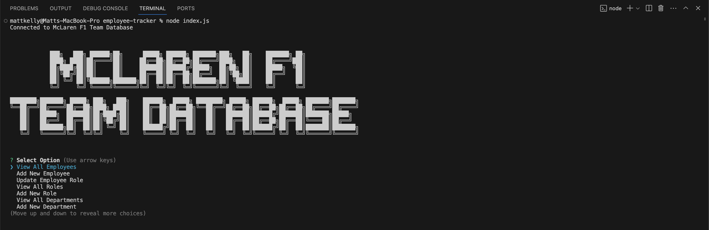
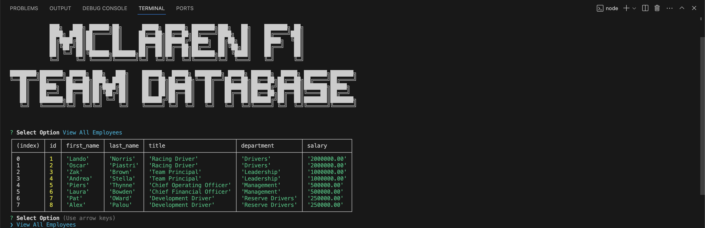
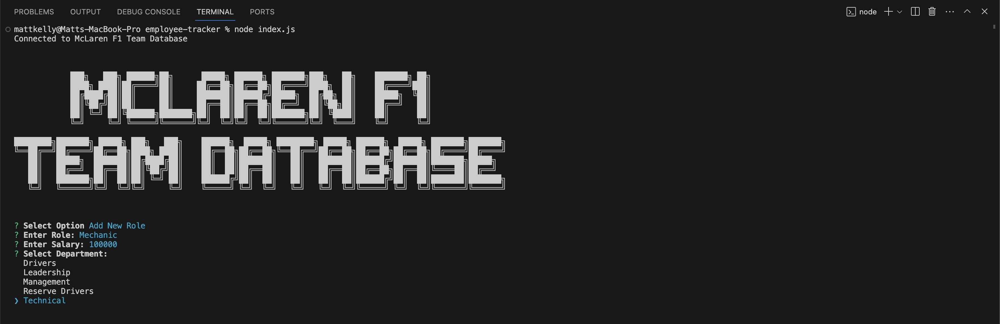

# Note Taker

## Description
Manage your team more efficiently with this content management system built with Inquirer and MySQL. This particular version has been built demonstrating it's capability managing the employee information for the McLaren Formula 1 Team.

## Table of Contents
- [Description](#description)
- [Installation](#installation)
- [Usage](#usage)
- [Contribution](#contribution)
- [Tests](#tests)
- [License](#license)
- [Questions](#questions)

## Installation Instructions
To install this application, clone this repository to your local machine and install all relevant packages by executing "npm install". Please note, Node.js must be installed on your local machine for this application to run. 

## Usage
To view a live demonstration of this application, please visit this [link](https://www.youtube.com/@mattkelly9107). To use this application on your local machine execute "node index.js" or "npm start" to start the application via your terminal. 

Once the application is running, users can view the main menu for the database.

</img>

Select "View All Employees" to view all employees. Users can also "View All Departments" and "View All Roles".

</img>

This content management system also allows users to "Add New Department", "Add New Role", "Add New Employee" and "Update Employee Role".

</img>

## Contribution Guidelines
This project was developed by Matt Kelly.

## Tests
There are no tests associated with this project. 

## License

This project is not licensed. For more information regarding licences, please visit this link: https://opensource.org/license/

## Questions
Please feel free to contact me via my GitHub or email below for any questions associated with this application:  
GitHub: [mattkellyirl](https://github.com/mattkellyirl)  
Email: mattkellyvisual@gmail.com